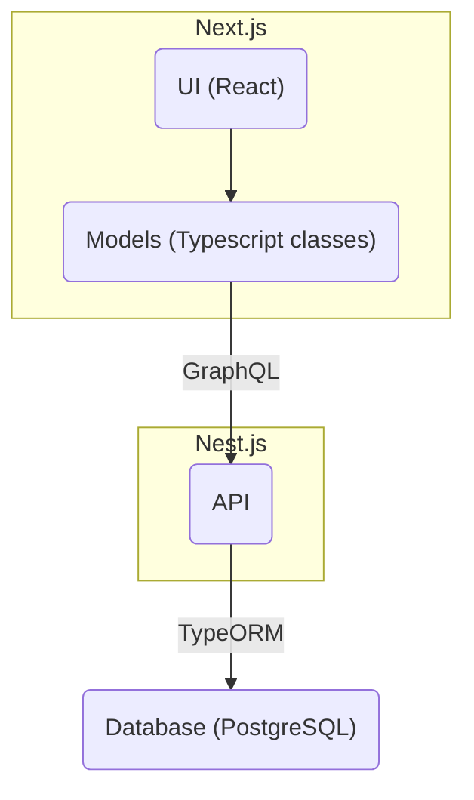
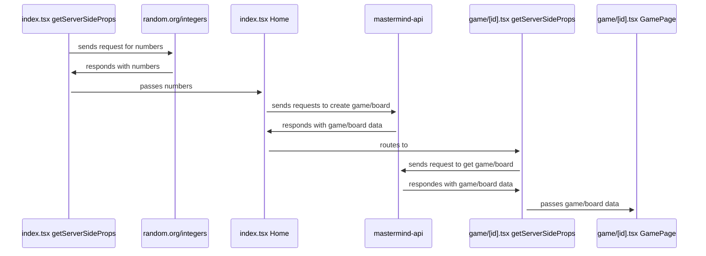
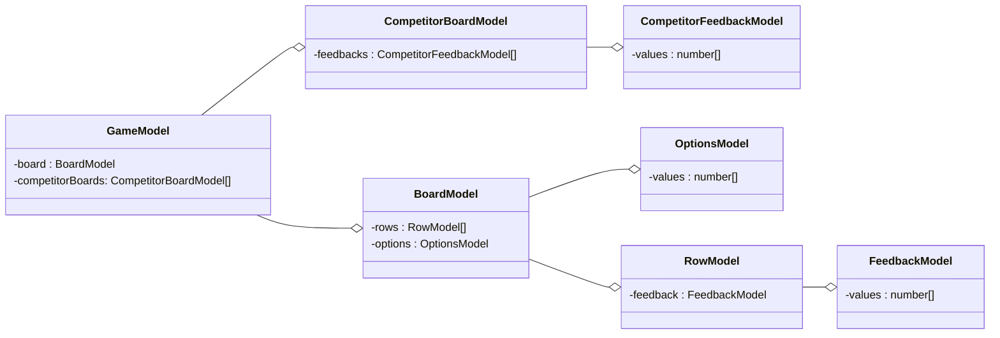
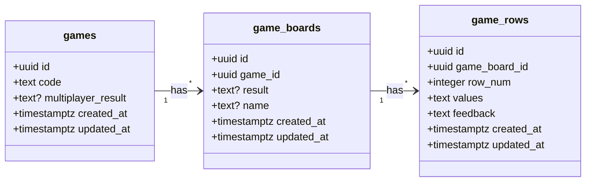

# ⚃ Mastermind ⚃

# How to play

To play, please visit this link: https://mastermind-olive.vercel.app/

From there you can play my implementation of the classic Mastermind game or my extension, Mastermind Race, where you can race others to see who can crack the code fastest!

To run my code locally, you can clone my repository, cd into the `web` folder , and run

```
npm run dev
```

To run my test cases, you can run

```
npm test
```

# Development Process

The first step in my process was to do research into the game Mastermind, since I hadn't heard of this game before. I looked into some online verisions of the game to get familiar with the UI and how the game worked.

Once that was done, I started my coding process. One of the first decisions I made when working on this project was to use React, since I have used it extensively in my current job and knew I get could something working quickly. I also chose to use Next.js as my react framework. Once I opened my repo, created my Next application, I got started making simple react components for my mastermind game board.

I initially considered just using react state to keep track of the game, but quickly realized I needed a layer behind the UI to store the game. So I created my Models, which were typescript classes to represent the various aspects of the mastermind board.

Once I was done with that, I decided I wanted to deploy my site, and Vercel (company that makes Next.js) has an easy way to deploy a Next.js site, so I went with that.

When thinking of what extensions I wanted to add to my game, the first idea I had was to use a database and API to store the game state of boards. This would allow users to maintain their in-progress game even if they refresh. I also knew at this point that if I had time, I would also want to try to incorporate some multiplayer aspect as an addtional extension, so I kept that in mind as I went ahead to make my API and database.

I decided to use Render as my service to host my API and database. First I created my database through Render, and connected to it through SQLPro for Postgres.

For my API that would communicate with my database, I made a Nest.js application and chose to go with the GraphQL code-first apporach (the schema is generated after code is written).

I ran into some challenges when getting my API to run successfully on render.

I got it working in production, but I ran into an error where my local api couldn't connect to my database. So I ended up deciding to time box that issue just to not be held up so I make sure to have time to finsih the other aspects of the project.

# Code Structure

Here is an diagram with an overview of my code structure. I used React for my UI, created classes for my game model representatiom, used GraphQL to send requests to my API, used Nest.js for my API, and made a PostgreSQL database. The following sections go into each of these aspects in more detail.



## What happens when you first load the site?

Here is a diagram illustrating what happens when my site first loads and when the user lands on the main game page.



## UI

I used React and tailwind for my UI. My approach to the UI was to seperate out the UI into as granular components as possible and to place each of those components into its own file to maintain code organization. I also used Radix Dialog to create the "Rules" modal.

## Models

The models are typescript classes responsible for instantiang objects and making graphql queries and mutations. Here is a diagram of all the classes I made and their relationship to eachother. I chose to use aggregation so I could represent the "has a" porperty of my classes.



## API

For my API, I used Nest.js, and chose to use GraphQL to define queries and mutations, and TypeORM to connect to my database.

I created resources corresponding to each of my database tables:

- games
- games_boards
- game_rows

## Database (postgres)

For my database, I choose to use PostgreSQL. Knowing early on I wanted to support the idea of a multiplayer game, I decided the game table would be my "top level" one, and it would have a foriegn key to the game_boards table. This would create a one-to-many relationship between the game and game_boards tables.

Initially I also had a players table, and the game_boards table had a forgien key to the players table. As I continued working on this, as a means to get a MVP, I realized I could "merge" the idea of players with boards by adding a name column to the game_board table.



# Extensions

## Persisting Game State

The first extension I implemented was persisting the game state. This was achieved by creating my database and API as described above, and setting up my games/[id].tsx page to query the game and game board.

## Multiplayer

The next extension I implemented was multiplayer functionality. This was achieved by creating queries to get competitor game boards.

Intially I wanted to use web sockets, specifically the library socket.io to create the realtime updates between two players. I got a basic version with socket.io working locally, but after looking into it, I realized that Vercel doesn't work with web sockets in production.

So I chose to instead use polling, a technique to periodically send query at a given interval until a condition is met. Polling starts as soon as the player creates or joins a multiplayer game, and it finishes as soon as one player wins or every player looses.

# Reflections

## Known bugs / desired improvmenets

- game_boards table needs to have a unique constraint on the name
- the game_rows table needs a unique pair contraint between the game_board_id and row_num
- Set up my developmenet environement more so i have a local db and local api... maybe use and learn docker more.

## Things I learned

- Mastermind
