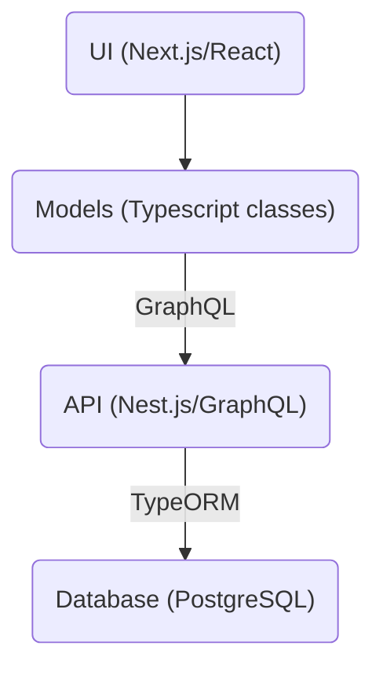
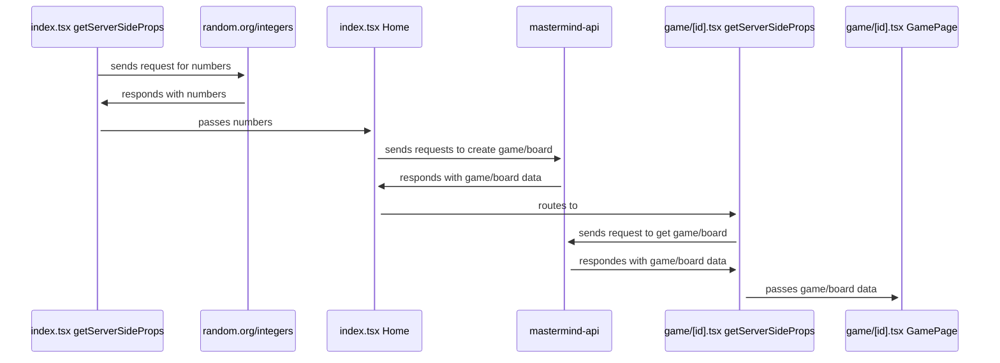
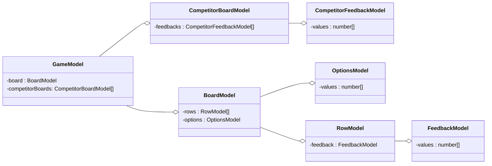
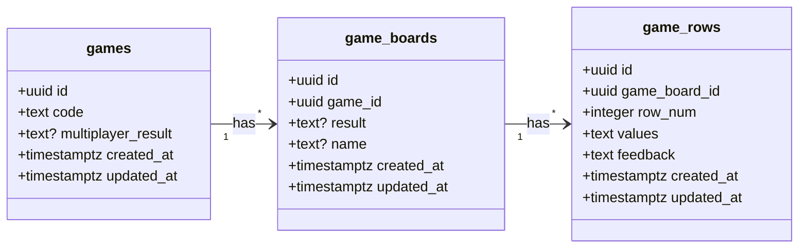
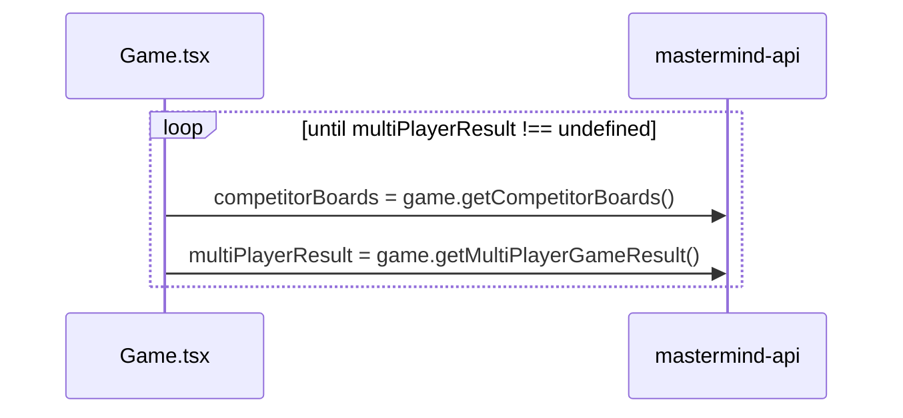

# ⚃ Mastermind ⚃

# How to play

To play, please visit this link: https://mastermind-olive.vercel.app/

From there you can play my implementation of the classic Mastermind game or my extension, Mastermind Race, where you can race others to see who can crack the code fastest!

To run my code locally, you can clone my repository, cd into the `web` folder , and run

```
npm run dev
```

To run my test cases for the feedback logic, you can run

```
npm test
```

# Development Process

1. <ins>Research</ins>: The first step in my process was to do research into the game Mastermind. I looked into some online verisions of the game to get familiar with typical UIs and how the game worked.

2. <ins>UI</ins>: Once that was done, I started my coding process. One of the first decisions I made when working on this project was to use React, since I am fairly comfortable with it and wanted to get the UI done quickly. I also chose to use Next.js as my react framework. Once I opened my repo, created my Next application, I got started making simple react components for my Mastermind game board.

3. <ins>Game logic</ins>: I initially considered just using react state to keep track of the game, but quickly realized I needed a layer behind the UI to store all the game logic. So I created my models, which were Typescript classes to represent the various aspects of the mastermind board.

4. <ins>Deploy frontend</ins>: Once I was done with that, I decided I wanted to deploy my site, and [Vercel](https://vercel.com/) has an easy way to deploy a Next.js site, so I went with that.

5. <ins>API Planning</ins>: When thinking of what extensions I wanted to add to my game, the first idea I had was to use a database and API to store the game state of board. This would allow users to maintain their in-progress game even if they refresh. I also knew at this point that if I had time, I would also want to try to incorporate some multiplayer aspect as an addtional extension, so I kept that in mind as I went ahead to make my API and database.

6. <ins>Created DB</ins>: I decided to use [Render](https://render.com/) as my service to host my API and database. First I created my database through Render, and connected to it through my PostgresSQL database client of choice, SQLPro for Postgres. Through SQLPro, I created by databases, and kept track of all the SQL queries I wrote in the `migrations` folder.

7. <ins>Created API</ins>: For my API that would communicate with my database, I chose to use [Nest.js](https://docs.nestjs.com/) since it has built in Typescript support. I made my project and chose to go with the GraphQL code-first apporach (explained further below). From there I made the resources using [Nest.js CRUD generator](https://docs.nestjs.com/recipes/crud-generator). This creates boiler plate code, like service and resolver files, which I then was able to fill in with the nessecary queries and mutations I wanted.

8. <ins>Brainstormed multiplayer</ins>: Once I had state persistance working, I had to brainstorm how I would want my multiplayer functionality to work. Inspired by [Jackbox games](https://www.jackboxgames.com/), where one person shares a game code with the rest of the players, I decided I could use a similar approach, where the UUID of the game would be the code!

9. <ins>Implemented multiplayer</ins>: Once I had that idea secured, I worked on implemnting the idea. This is described in more detail below in the Extensions section!

# Code Structure

Here is an diagram with an overview of my code structure. I used React for my UI, created classes for my game model representatiom, used GraphQL to send requests to my API, used Nest.js for my API, and made a PostgreSQL database. The following sections go into each of these aspects in more detail.



## What happens when you first load the site?

Here is a diagram illustrating what happens when my site first loads and when the user lands on the main game page.



## UI

I used React and [Tailwind](https://tailwindcss.com/) for my UI. My approach to the UI was to seperate out the UI into as granular components as possible and to place each of those components into its own file to maintain code organization. I also used the [Radix Dialog](https://www.radix-ui.com/docs/primitives/components/dialog) to create the "Rules" modal.

## Models

The models are TypeScript classes responsible for storing game state, performing game logic, and making GraphQL queries and mutations. Here is a diagram of all the classes I made and their relationship to each other. I chose to use aggregation so I could represent the "has a" porperty of my classes. For example, the game "has a" board and the board "has a" list of rows.



## API

For my API, I used [Nest.js](https://nestjs.com/), and chose to use GraphQL to define queries and mutations, and TypeORM to connect to my database. If using GraphQL with Nest.js, you can choose between a code-first or schema first approach (described [here](https://docs.nestjs.com/graphql/quick-start#overview)). I choose code-first, as it allowed me to work in Typescript on both the front-end and back-end.

I created resources corresponding to each of my database tables. Here is a list of the queries and mutations defined on each resource:

- games

  - createGame
  - findGameById
  - updateMultiplayerResult

- games_boards

  - createGameBoard
  - updateGameResult
  - findGameBoardById
  - findCompetitorGameBoards

- game_rows
  - createGameRow
  - findGameRowById

I also included a rows `@ResolveField` on game_boards which allowed me to query all the rows of the board when doing the `findGameBoardById` and `findCompetitorGameBoards` queries

```
query findGameBoardById($id: ID!) {
    findGameBoardById(id: $id) {
      result
      name
      rows {
        row_num
        values
        id
      }
    }
  }
```

## Database (postgres)

For my database, I choose to use PostgreSQL. Knowing early on I wanted to support the idea of a multiplayer game, I decided the game table would be my "top level" one, and it would have a foriegn key to the game_boards table. This would create a one-to-many relationship between the game and game_boards tables.

Initially I also had a players table, and the game_boards table had a forgien key to the players table. As I continued working on this, as a means to get a MVP, I realized I could "merge" the idea of players with boards by adding a name column to the game_board table.



# Extensions

## Persisting Game State

The first extension I implemented was persisting the game state. This was achieved by creating my database and API as described above, and setting up my games/[id].tsx page to query the game and game board, so every time the user refreshes the board is quered and populated with the data.

Here is a video of the persisting game state feature!

https://user-images.githubusercontent.com/45411265/210295929-97681bf2-bc6b-45b9-9be6-305ae32015a2.mov

## Multiplayer

The next extension I implemented was multiplayer functionality. This was achieved by creating queries to get competitor game boards.

Intially I wanted to use web sockets, specifically the library [socket.io](https://socket.io/) to create the realtime updates between two players. I got a basic version with socket.io working locally, but after looking into it, I realized that [Vercel doesn't support web sockets](https://vercel.com/guides/do-vercel-serverless-functions-support-websocket-connections).

So I chose to instead use polling to continuosly query the compeitor game boards until the multiplayer game result is updated. Polling starts as soon as the player creates or joins a multiplayer game, and it finishes as soon as one player wins or every player looses. Here is a diagram showing how the polling is working.



Here is a video of the multiplayer feature!

https://user-images.githubusercontent.com/45411265/210296790-11d05aab-cbab-4b51-8d09-5af26d207a23.mov

# Reflections

## Known bugs / desired improvmenets

- If two players with the same name enter one game, the multiplayer game result won't be updated correctly since I am used a dictionary to compute that value, which relies on unique keys. The solution would be to enforce a unique constraint on the name column in the game_boards table and then have error handeling on the front end. Another solution would be to implement login and store player information in it's own table.
- If you open the same game in two browsers and update the rows, and then refresh, the board will be loaded with all the rows from both games. The solution would be to enforce a unique contraint on the game_rows table between the game_board_id and row_num columns. In other words, it should not be allowed to have two game_row entries both with a row_num of 1 and both with the same game_board_id. Once the unique constraint is enforced, then there should also be error handeling on the front end. Another possiblity would be to optomistically update the row and upon any error, the row falls back to the empty state.
- I noticed sometimes, the first time I click of one the start game buttons on the inital page, it takes a while for the game page to load. I believe this is because of the way I have it set up where the game and board are created on the index.tsx page and then queried again in the [id].tsx page as I described in the above diagram.
- I currently represent the default board values as -1 values which I render as dark gray on the frontend. I also allow users to submit checks even if they did not fill out all the number values. If someone submits a row without all the numbers inputted and then refresh, the -1 values get saved into the database, and get parsed incorrectly on the frontend when the data loads in.
- When I was working on setting up my development environment, I time boxed it, and decided to just made a production database and production API. I was running into errors when trying to run my local API, so I decided to just punt on that issue. I think ideally, I maybe would have even looked into setting up my developmenet environement with Docker.

## Things I learned

Overall this was a really fun and challenging project to work on! Here are some of the things I learned

- Web sockets are a great way to allow realtime communication and not as difficult to implement as I thought. But they do not work on Vercel
- Implementing complex game logic is immensly easier with test driven development! I was running into issues initially when impelenting the algothm to figure out the feedback based on guesses, and creating test cases made the process much more smooth.
- Using `private` and `readonly` when making classes helps ensure what can be accessed
