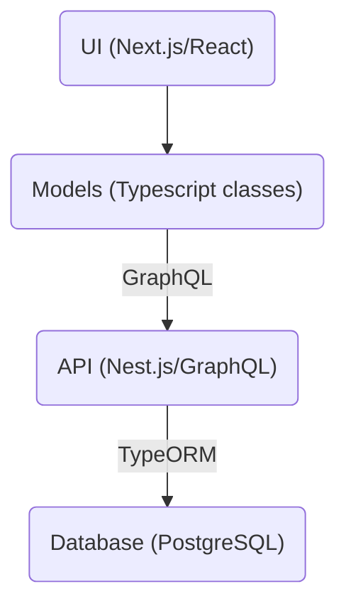
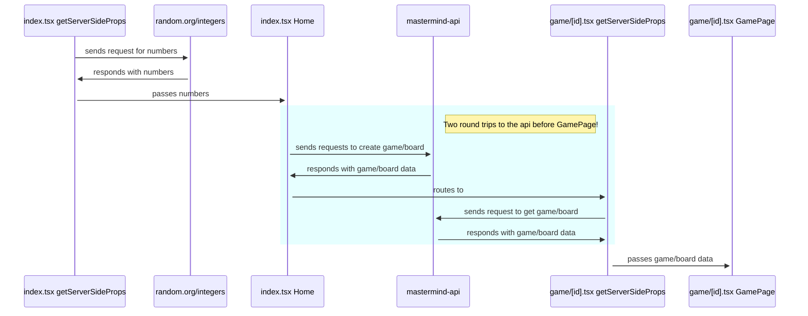
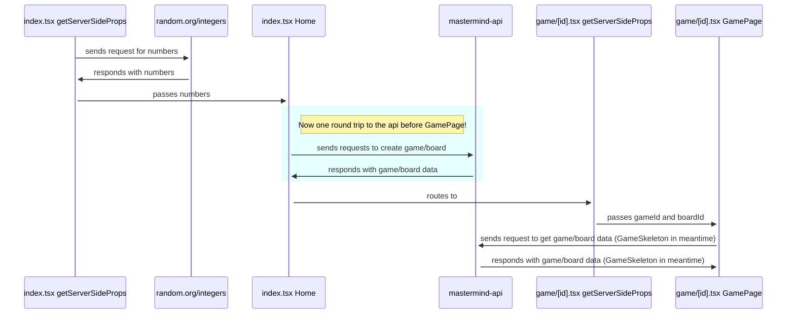
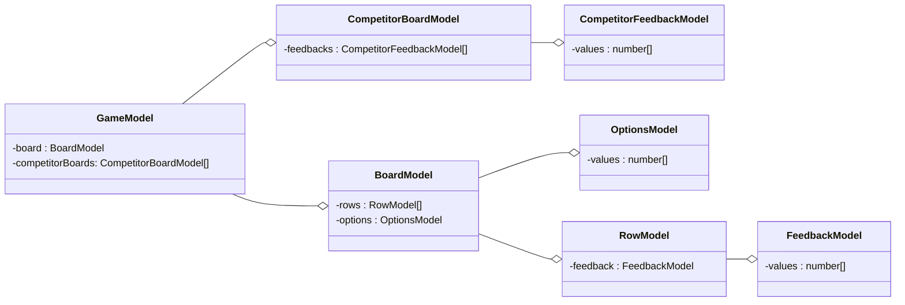
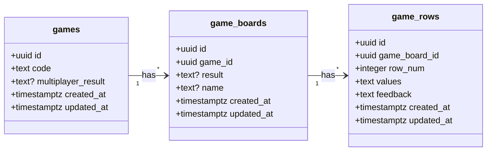
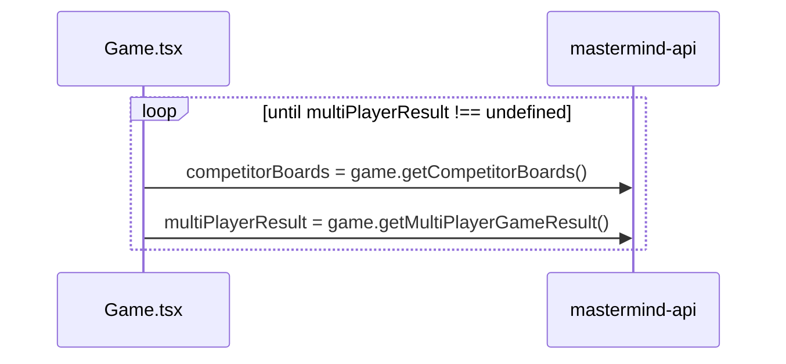

# ⚃ Mastermind ⚃

# Table of Contents

- [Overview](#overview)
- [How to play](#how-to-play)
- [Development Process](#development-process)
- [Code Structure](#code-structure)
  - [Data fetching](#data-fetching)
  - [UI](#ui)
  - [Models](#models)
  - [API](#api)
  - [Database](#database)
- [Extensions](#extensions)
  - [Persisting Game State](#persisting-game-state)
  - [Multiplayer](#multiplayer)
- [Edge cases](#edge-cases)
  - [Two players with same name](#two-players-with-the-same-name)
  - [Game opened in multiple windows](#same-game-opened-in-two-windows)
  - [Checking unfilled row](#checking-a-row-without-all-numbers-filled)
- [Reflections](#reflections)
  - [Desired Improvements](#desired-improvements)
  - [Things I learned](#things-i-learned)

# Overview

This is a web application that allows users to play Mastermind two ways!

1. Play the classic Mastermind: just you against the computer!
2. Play Mastermind Race: compete with friends to see who can crack the code fastest!

 

# How to play

To play, please visit this link: https://mastermind-olive.vercel.app/

From there you can play my implementation of the classic Mastermind game or my extension, Mastermind Race, where you can race others to see who can crack the code fastest!

To run my code locally, you can clone my repository, cd into the `web` folder , and run

```
npm run dev
```

You may also have to run `npm install` before `npm run dev` depending on what you already have installed on your computer.

To run my test cases for the feedback logic, you can run

```
npm test
```

# Development Process

<ins>Understand Requirements and Creating a Big Picture Plan</ins>

The first step in my process was to fully understand the product requirements. After thoroughly reading the guide, making test requests to the Integer Generator API, and reading the [Mastermind Wikipedia page](<https://en.wikipedia.org/wiki/Mastermind_(board_game)>) to understand the feedback logic, I understood my task and timeline. After brainstorming potential extensions, I knew something I'd love to try to tackle is making Mastermind a multiplayer game! My initial idea was to implement a two player game, where one person is the code breaker and another is the code generator, essentially taking the place of the computer. But after some more thought, I came up with a different way to make the game multiplayer -- by turning it into a race! Inspired by [Jackbox games](https://www.jackboxgames.com/), I thought of the idea where multiple players would be in one "game room", and everyone would see the other player's feedback. This would create tension as everyone can tell, based on the feedback the other player's are receiving, how close they are to cracking the code! I was really excited by this idea, and I had a vague sense that it would require some form of realtime communication, like WebSockets, but beyond that, I didn't have a clear picture of how to implement this. So I thought of another extension that I was more confident I could achieve, and something that I also thought would be really useful -- persisting game state, since it would allow users to maintain there in-progress games, instead of loosing their progress after refresh! From there, I created this flexible plan, since I didn't know exactly how long each step would take and which potential road blocks I would face:

- Basic Mastermind implementation: 2-3 days
- Setting up DB and API: 1-2 days
- Data persistance: 2-3 days
- WebSockets research: 1 day
- Multiplayer: 2-3 days
- Debugging / Polishing / Readme: 1-2 days

Here is how my process panned out:

1. <ins>Basic Mastermind implementation</ins>: One of the first decisions I made when working on this project was to use React, since I am fairly comfortable with it and wanted to get the UI done quickly. I also chose to use Next.js as my react framework. So once I opened my repo, created my Next.js application, I got started making simple react components for my Mastermind game board. Next, I considered just using React state to keep track of the game, but quickly realized I needed a layer behind the UI to store all the game logic. So I created my models, which were Typescript classes to represent the various aspects of the mastermind board. This is described in more detail below in the [Models section](https://github.com/allangelman/mastermind#models).

1. <ins>Deploy frontend</ins>: Once I was done with that, I decided I wanted to deploy my site, and [Vercel](https://vercel.com/) has an easy way to deploy a Next.js site, so I went with that.

1. <ins>Database and API Setup</ins>: I decided to use [Render](https://render.com/) as my service to host my API and database. First I created my database through Render, and connected to it through my PostgresSQL database client of choice, SQLPro for Postgres. For my API that would communicate with my database, I chose to use [Nest.js](https://docs.nestjs.com/) since it has built in Typescript support. I made my project and chose to go with the GraphQL code-first approach (explained further in the [API section](https://github.com/allangelman/mastermind#api)). From there I made the resources using [Nest.js CRUD generator](https://docs.nestjs.com/recipes/crud-generator). This creates boiler plate code, like service and resolver files, which I then was able to fill in with the necessary queries and mutations I wanted.

1. <ins>Persisting Data</ins> Now that my Database and API where set up, I started creating the tables and API resources necessary for persisting data. Through SQLPro, I created my databases, and kept track of all the SQL queries I wrote in the [migrations](https://github.com/allangelman/mastermind/tree/main/migrations) folder. The first table I made was actually a players table, in anticipation of making my game multiplayer, but later deleted that table (explained here in the [DB section](https://github.com/allangelman/mastermind#database)). You can see the final state of my DB tables and my process in that section as well. After the tables were created and the Nest.js resources were filled in, I had to figure out how to get the data to re-load when a user refreshes the page in order for the data to be persisted. You can read about how I approached this in the [Data fetching](https://github.com/allangelman/mastermind#data-fetching) section.

1. <ins>Websocket research</ins> Once I had data persisted, I started researching WebSockets. I read a few articles and eventually found this helpful [YouTube tutorial](https://www.youtube.com/watch?v=djMy4QsPWiI) that showed how to implement basic WebSockets with the Socket.io library. I followed the tutorial, along with this [article](https://blog.logrocket.com/implementing-websocket-communication-next-js/) which showed how to integrate Socket.io with Next.js, and got basic WebSocket functionality working, where I made a text box whose value would update in every window I had open. This worked locally, but after running into issues with getting this working in production, I did some research and found that Vercel (the deployment service I was using) [does not support WebSockets](https://vercel.com/guides/do-vercel-serverless-functions-support-websocket-connections). I briefly considered switching deployment services, but then I remembered that during my initial research about WebSockets, I watched this [video](https://www.youtube.com/watch?v=ZBM28ZPlin8) which described the difference between short polling, long polling, and WebSockets. It was described that while short polling is usually a bad design decision ultimately, since it uses up resources on both the client and server, it is acceptable to use for fast prototyping. So I went ahead with short polling.

1. <ins>Polling implementation</ins> Short polling turned out to not be too difficult to implement itself, since I already had the infrastructure in place to query my database. The most complicated part was figuring out how to organize the code and have it stop polling when the game ended. The final polling design can be seen here in the [Multiplayer section](https://github.com/allangelman/mastermind#multiplayer). The more time consuming part of this part of the project was creating new database queries to get the competitor game boards and parsing the data on the frontend. I created a `findCompetitorGameBoards` query that gets all the boards associated with a game ID excluding the current "player".

1. <ins>Testing and Discovering Edge Cases</ins> After I had polling working, I stress tested my application by seeing what happens in cases that aren't how I intend the application to be used. Initially I just noted these edge cases in my to-do list and decided it was not high priority to address them right away, since I still had to make my ReadMe.

1. <ins>Making ReadMe</ins> This involved creating diagrams using [Mermaid](https://mermaid.js.org/#/) and taking screen recordings and screenshots. Once I had all those assets, I started drafting my whole process here.

1. <ins>Addressing Edge Cases</ins> Once I had a draft of my ReadMe, I started addressing the edge cases. You can see the edge cases I found and the solutions for them in the [Edge Cases](https://github.com/allangelman/mastermind#edge-cases) section.

1. <ins>Refactor UI and finish ReadMe</ins> After I finished addressing the edge cases, I decided I wanted a slightly more appealing UI, so I refactored the UI using a theme of rounded rectangles and line divisions to create an appealing and easy to parse UI. Once that was done, I finished my ReadMe.

# Code Structure

Here is a diagram with an overview of my code structure. I used React for my UI, created classes for my game representation, used GraphQL to send requests to my API, used Nest.js for my API resources, and made a PostgreSQL database. The following sections go into each of these aspects in more detail.



## Data fetching

One part of the code I spent quite a bit of time refactoring is the index.tsx and [id].tsx pages in order to optimize the user's first experience in terms of load time and to get Data Persistence to work.

After a few iterations, here is a diagram illustrating how my almost final version looked like. I leverage the getServerSideProps functionality of Next.js to query the code in index.tsx and to query the game and board in [id].tsx. While querying the game and board in getServerSideProps in [id].tsx worked well on any refresh after an initial load, it caused an issue for the user's first load experience. Making this diagram actually helped me pinpoint and solve the issue! If you can see from the light blue rectangle region, I was making two round trips to the api before the GamePage loaded! That meant the user would be stuck on the initial page after having clicked the button to start the game until all of those requests resolved!



The way I refactored this was to move the queries for the game and board into a useEffect in GamePage.tsx and create a SkeletonGame that displays while the data is being fetched! This way the game and board only have to be created before the user is routed to the GamePage. While in the end, the load time is technically still the same, it creates a more robust experience where the user is reassured that their game is loading because their first route to the GamePage happens much more quickly.



## UI

I used React and [Tailwind](https://tailwindcss.com/) for my UI. My approach for the UI was to separate it out into as granular components as possible and to place each of those components into their own files to maintain code organization. I also used the [Radix Dialog](https://www.radix-ui.com/docs/primitives/components/dialog) to create the "Rules" modal.

## Models

The models are TypeScript classes responsible for storing game state, performing game logic, and making GraphQL queries and mutations. Here is a diagram of all the classes I made and their relationship to each other. I chose to use aggregation so I could represent the "has a" property of my classes. For example, the game "has a" board and the board "has a" list of rows.



## API

For my API, I used [Nest.js](https://nestjs.com/), and chose to use GraphQL to define queries and mutations, and TypeORM to connect to my database. If using GraphQL with Nest.js, you can choose between a code-first or schema first approach (described [here](https://docs.nestjs.com/graphql/quick-start#overview)). I choose code-first, as it allowed me to work in Typescript on both the front-end and back-end.

I created resources corresponding to each of my database tables. Here is a list of the queries and mutations defined on each resource:

- games

  - createGame
  - findGameById
  - updateMultiplayerResult

- games_boards

  - createGameBoard
  - updateGameResult
  - findGameBoardById
  - findCompetitorGameBoards

- game_rows
  - createGameRow
  - findGameRowById

I also included a `rows` `@ResolveField` on game_boards which allowed me to query all the rows of the board when doing the `findGameBoardById` and `findCompetitorGameBoards` queries like this instead of querying the rows separately:

```
query findGameBoardById($id: ID!) {
    findGameBoardById(id: $id) {
      result
      name
      rows {
        row_num
        values
        id
      }
    }
  }
```

The reasoning I used to create these queries and mutations was thinking about what data needs to be saved, updated an read. For data that needs to be saved, like game_rows, I would make a `create` mutation. For data that needs to be updated, like game results, I would make `update` mutation. For data that needs to be read, like game_boards, I would make `find` queries.

## Database

For my database, I choose to use PostgreSQL. Knowing early on I wanted to support the idea of a multiplayer game, I decided the game table would be my "top level" table, and it would have foreign keys to the game_boards table. This would create a one-to-many relationship between the game and game_boards tables. There would also be a one-to-many relationship between the game_boards and game_rows.

Initially I also had a players table, and the game_boards table had a foreign key to the players table. As I continued working on this, as a means to get something working faster, I realized I could "merge" the idea of players with boards by adding a name column to the game_board table. Essentially, a board has a name, and a player is just a board with a name. Since there is a one-to-many relationship between a game and a game_board, and a "player" is just a board with a name, this is how I represented a multiplayer game. In [desired improvements](https://github.com/allangelman/mastermind#desired-improvements), I discuss that I would like to bring the players table back as this would allow for more fun extensions!



# Extensions

## Persisting Game State

The first extension I implemented was persisting the game state. This was achieved by creating my database and API as described above, and setting up my games/[id].tsx page to query the game and game board, so every time the user refreshes, the necessary data is queried and the board is populated with the data.

Here is a video of the persisting game state feature (refresh happens at 0:35)!

https://user-images.githubusercontent.com/45411265/210691034-ab6da477-af16-4eba-8867-2503de750b11.mov

## Multiplayer

The next extension I implemented was multiplayer functionality. This was achieved by creating queries to get competitor game boards.

Initially I wanted to use WebSockets, specifically using the library [socket.io](https://socket.io/) to create the realtime updates between two players. As described in my development process, I got a basic version with socket.io working locally, but after looking into it, I realized that [Vercel doesn't support web sockets](https://vercel.com/guides/do-vercel-serverless-functions-support-websocket-connections).

So I chose to instead use short polling to continuously query the competitor game boards until the multiplayer game result is updated. Polling starts as soon as the player creates or joins a multiplayer game, and it finishes as soon as one player wins or every player looses. Here is a diagram showing how the polling is working.



Here is a video of the multiplayer feature!

https://user-images.githubusercontent.com/45411265/210690974-ae0e4cde-43d8-4e4e-b764-06261d06a1f1.mov

Here is a video of the multiplayer game reaching an end state when one player wins!

https://user-images.githubusercontent.com/45411265/210691014-4da278a6-7142-47df-911b-c300ce65134a.mov

# Edge cases

## Two players with the same name

When I tested to see what would happen if two players with the same name enter one game, I realized the game result was not being generated correctly. This was because I used a dictionary with player names as keys to compute that value, and keys in dictionaries have to be unique. The solution I came up with was to enforce a unique pair constraint between the `name` column and the `game_id` column in the `game_boards` table. This makes it such that every board that points to the same game_id has a unique name. Once I deleted the rows in my database that violated that constraint and ran that [query](https://github.com/allangelman/mastermind/blob/main/migrations/12_unique_pair_constraint_on_game_id_and_name.sql), I implemented basic error handling on the front end. Here is a video of this error handling:

https://user-images.githubusercontent.com/45411265/210691067-f57a3452-7685-4f4f-a655-0e07f1c6896b.mov

## Same game opened in two windows

Another thing I tested was opening the same game in two browsers and updating the same rows. When I refreshed, the board got loaded with all the saved rows between the two windows. The reason this was happening is because I was not addressing the case of the same row being submitted twice. The solution I came up with was again to enforce a unique constraint, this time on the `game_rows` table between the `game_board_id` and `row_num` columns. For example, it should not be allowed to have two `game_row` entries both with a `row_num` of 1 and both with the same `game_board_id`. Once the unique constraint was enforced, I added error handling on the front end. This was something I wanted to spend more time on to display the error in a modal potentially, since it currently creates a disruptive UI experience. I noted this in this [Desired Improvements section](https://github.com/allangelman/mastermind#desired-improvements). Here is a video of the error handling:

https://user-images.githubusercontent.com/45411265/210691086-603b4327-d9ff-43cd-987a-1b7459c5bd33.mov

## Checking a row without all numbers filled

Another edge case I ran into was submitting a row with not all number slots filled in. I initially represented the default board values as -1 values which I render as dark gray on the frontend. So if someone submits a row without all the numbers inputted and then refresh, the -1 values would get saved into the database, and would get parsed incorrectly on the frontend when the data loads in. My solution was to change the -1 to an 8 (since the only numbers allowed are 0-7) right before it gets saved to the database. I explained this further in the comments of the code [here](https://github.com/allangelman/mastermind/blob/main/web/models/RowModel.tsx#L43).

https://user-images.githubusercontent.com/45411265/210691117-9338ba22-37b0-4340-8663-d17a42ffcf6c.mov

# Reflections

## Desired improvements

- When I was working on setting up my development environment, I was running into errors getting my API to run locally, specifically it could not connect to my database. Because I wanted to not be blocked by this issue, I time boxed it, and decided to just use my production API when testing locally. I think ideally, I would have spent more time configuring my development environment, and maybe even looked into using Docker.
- I think it would be really cool to implement "actual" players for this multiplayer game. This would solve the edge case I ran into regarding unique names, since implementing players would most likely involve introducing a sign up/log in flow. The email could potentially act as the unique player identifier. This would also allow to see a players past games, by simply adding a findGamesByPlayerId query to the API!
- I would have liked to spend more time on error handling in the UI. Currently one of the ways I implemented error handling on the frontend (when the same row is submitted twice), creates a disruptive user experience. It would also be useful to spend more time figuring out how to create more detailed error messages.

## Things I learned

Overall this was a really fun and challenging project to work on! Here are some of the things I learned

- WebSockets are a great way to allow realtime communication and not as intimidating to implement as I thought. Unfortunately, Vercel does not support it.
- I learned that `getServerSideProps` are useful to load data but should be used carefully as they can still cause an increase in initial load time
- Long polling or WebSockets are better than short polling, but short polling is good for fast prototyping.
- Implementing complex game logic is easier with test driven development! I was running into issues initially when implementing the algorithm to figure out the feedback based on guesses, and creating test cases made the process much more smooth.
- Using `private` and `readonly` when making classes helps to ensure what can be accessed from where
