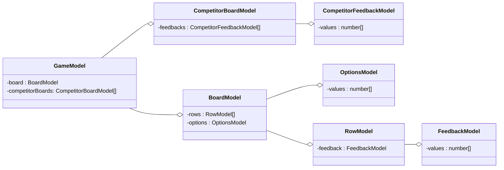
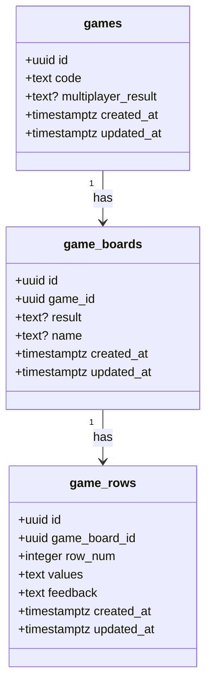

# ⚃ Mastermind ⚃

# How to play

To play, please visit this link: https://mastermind-olive.vercel.app/

From there you can play Mastermind or my extension, Mastermind Race.

To run my code locally, you can pull down my repo, cd into web, and do

```
npm run dev
```

to run my test cases

```
npm test
```

# Development Process

# Code Structure

## Pages

## UI (next, react)

## Models

The models are typescript classes responsible for instantiang objects and making graphql queries and mutations

- Game
- Board
- Row
- Feedback
- CompetitorBoard
- CompetitorFeedback
- Options



## API (graphql, nest)

## DB (postgres)



# Extensions

## Persisting Game State

## Multiplayer
